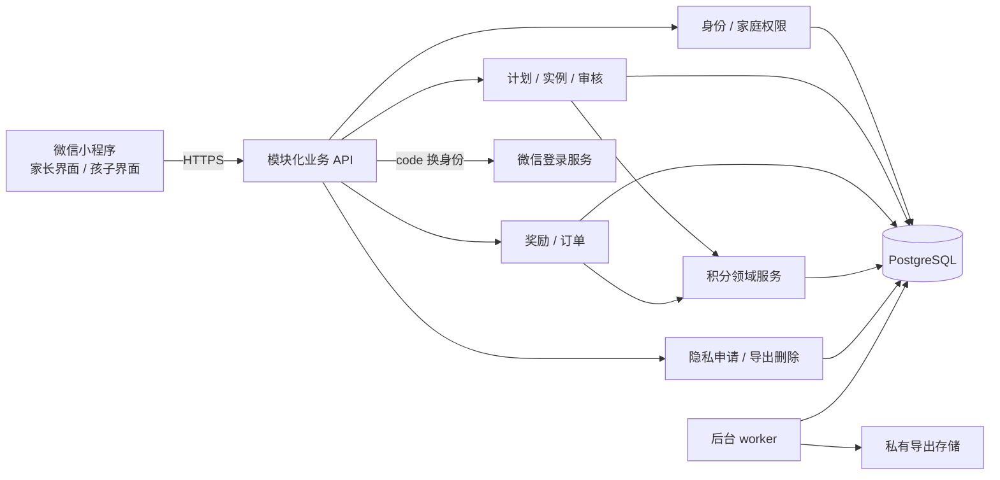
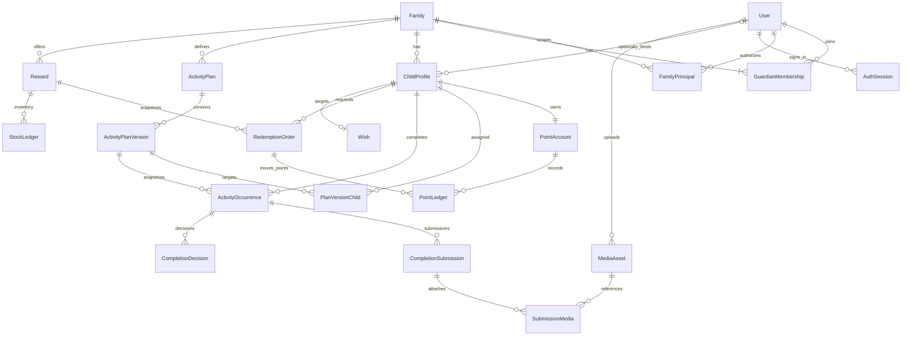

# 积乐圈家庭版：架构文档

版本：1.0 · 2026-09-19 · 状态：重建实施规格，尚未实现、未经容量测试。

本文面向从零实现的团队。业务规则以 [00-规则基线](00-规则基线.md) 为共同契约，接口见 [06-技术文档](06-技术文档.md)。旧代码仅帮助识别迁移风险，不是新系统的架构限制。

## 1. 架构决策与系统边界

首发采用模块化单体：一个微信小程序客户端、一个业务 API、一个同代码库的后台 worker、一个 PostgreSQL 主库。API 可横向扩容；所有实例共享数据库会话、幂等记录与任务状态。无须首发拆微服务、引入消息中间件或依赖 Redis 分布式锁。正确性由数据库事务、约束和统一领域服务保障。

建议客户端使用 uni-app、Vue 3、TypeScript、Pinia；服务端使用 NestJS、TypeScript、Prisma；数据库使用 PostgreSQL。具体兼容版本由重建团队启动时选择、锁定到 lockfile，并在 CI 中验证，不把旧仓库依赖号视作最新版本。P0 账号头像和孩子档案头像必须真实上传，完成提交可附照片；私有对象存储保存处理后的头像、完成照片和临时导出包。奖励封面使用内置插画，自定义奖励封面属于 P1。

客户端负责输入、展示、草稿和导航；服务器负责身份、适用范围、当前时间、活动达标、积分、库存、额度和状态迁移。微信识别登录账号，不证明真实姓名、年龄或监护关系；PIN 只是本产品的家长操作门槛。家长自行创建孩子档案并确认其管理权限。

## 2. 模块、边界与依赖

| 模块 | 负责 | 对外提供的领域能力 |
|---|---|---|
| Identity | 微信身份、强制头像昵称、登录会话、PIN、恢复码 | 解析 ActorContext、验证或撤销会话 |
| Media | 上传意图、真实格式校验、重编码、私有读取、保留期限 | 验证可关联媒体、生成鉴权读取 grant、按期清理 |
| Family | 家庭、成人关系、邀请、孩子档案、归档 | 家庭作用域授权、成员与生命周期锁 |
| Activity | 日常/挑战、版本、适用孩子、实例、提交与审核历史 | 物化实例、提交、审核、代录、免做、撤销完成 |
| Points | 双余额账户、不可变积分流水、表扬、冲正 | grant / hold / release / capture / refund / reverse |
| Rewards | 奖励版本、适用范围、库存与库存流水 | 校验新请求、预留与归还库存 |
| Redemption | 订单、批准、拒绝、取消、兑现、过期、周额度 | 单事务编排订单、积分、库存、额度 |
| Growth | 今天、首页、历史、成长与待办读模型 | 从事务事实聚合，禁止自建独立余额 |
| Privacy | 隐私同意版本、数据导出/删除申请与进度 | 范围校验、异步导出、受审计删除 |
| Operations | 幂等、审计、outbox、任务与对账 | 不确定结果查询、任务租约、异常报告 |

Controller 不直接更新余额、库存或状态；应用服务开启事务并调用持有同一 TransactionContext 的领域服务。领域服务不能自行开第二个独立事务。只允许 Points 写账户和积分流水，Rewards 写库存及库存流水。跨模块关系用 ID 和明确接口，避免互相注入形成循环。

## 3. 身份、租户和孩子模式的信任边界

### 3.1 身份模型

- `User` 是微信登录账号，不用全局 adult/child 标记替代家庭关系；`AuthIdentity` 用 `(provider, appId, subject)` 唯一绑定微信身份，不按昵称、头像或手机号合并。
- `GuardianMembership` 是成人与家庭的关系；家庭中唯一 `ownerMembershipId` 派生 OWNER，其他有效关系派生 GUARDIAN。成人账户无积分。
- `ChildProfile` 是家庭内孩子档案，独立 UUID、独立积分账户，`boundUserId` 可空，可绑定自己的微信账号，也可由家长代办。一个孩子不能同时属于多个家庭。同一 User 在同一家庭只能拥有家长关系或绑定一个孩子，两者互斥。
- 每个家庭表有 `familyId`，资源查询同时使用 `familyId + resourceId`，核心关联使用复合外键强制同家庭。
- 所有请求均解析 `ActorContext = {userId, sessionId, mode, childSessionSource?, familyId?, childId?, membershipId?, bindingVersion?}`；不接收客户端传入的 operatorId、角色、openid 作为权限依据。

家长会话可以在多个已加入家庭间切换；每次请求仍按路径家庭实时鉴权。孩子会话只能访问绑定 `familyId + childId` 的白名单接口，不能列其他孩子、家长列表或全家庭审计。DIRECT 另可管理自己的账号资料与个人隐私申请，DELEGATED 不能访问源家长账号资料。账号关系选择只返回自己有权进入的范围，不暴露家庭其他成员信息。客户端 capabilities 用于展示，服务端每个动作再次授权。

### 3.2 服务端会话状态

会话模式为 `PROFILE_ONLY / LOCKED / ACCOUNT / GUARDIAN / CHILD`；ACCOUNT 是资料完整但未选择家庭作用域的登录账号，仅可查看自身关系、自己的资料、申请加入/绑定或新建家庭。CHILD 另外必须区分 DIRECT / DELEGATED。成人 access token 不持久携带可信家庭角色。每次请求查会话未撤销、用户安全版本匹配、资料完成、家庭及孩子状态允许。DELEGATED 再验源家长关系，DIRECT 再验 `boundUserId` 与 bindingVersion；DIRECT 不依赖某个源家长会话。access token 建议 15 分钟；刷新凭据建议 30 天、随机 256 位、服务器只存哈希并轮换；时间均为本系统策略，可配置后通过测试。

1. 首次微信登录只取得 PROFILE_ONLY 会话。用户接受隐私说明，上传头像并填写昵称；媒体 READY 且昵称有效后服务端原子写 profileCompletedAt，再进入 ACCOUNT 关系选择。资料未完整只能访问账号资料、对应头像上传和公开说明，不能读家庭内容。已完成资料再次登录无须重传。
2. 账号已设家长 PIN 时，新微信登录先 LOCKED；解锁后仍检查资料完整。即使清本地存储、退出重进或再次调用 `wx.login`，也不能直接换取家长权限。LOCKED 只提供最少登录状态、PIN 验证、恢复和公开隐私说明。
3. 已有家长关系且已完成资料者选择家庭建立 GUARDIAN 作用域；DIRECT 绑定者选择自己的孩子关系建立 CHILD/DIRECT。前端选择角色不授予现有家庭权限；跨家庭逐关系判断。未设 PIN 的家长可先配置家庭，首次进入 DELEGATED 前强制设 PIN 并保存恢复码。
4. 进入 DELEGATED 在事务中撤销当前家长会话及刷新凭据，创建绑定该孩子的受限会话。客户端清空家长查询缓存及凭据，旧管理 token 立即拒绝；其他设备已有合法成人会话可继续。
5. DELEGATED 退出或切换孩子需源家长 PIN，撤销旧孩子会话，先签发新的 GUARDIAN 会话；切换时再进入指定孩子。DIRECT 不接受这个升权接口，只能退出自己登录或切到自己已有的其他合法关系，不能输入家长 PIN 获得家长权限。
6. 过期与响应丢失不能自动升权。有效孩子刷新凭据只续期原来源/原作用域；否则重新微信登录，按 PIN/资料/关系门重新进入。所有会话状态都由服务端控制。

PIN 采用带独立盐的抗离线猜测密码哈希，算法及成本在重建时按安全库与设备容量选定；不得明文或可逆加密存储。账号维度 5 次连续失败锁定 15 分钟，同时按会话与来源限流，不以重装清零。失败返回剩余等待时间，不泄露 PIN 内容；并发失败计数原子更新。PIN 不是实名或监护资格认证，也不承诺防止掌控设备、调试环境、恢复码或家长凭据的人攻击。

### 3.3 PIN 重置及安全变化

启用 PIN 时生成至少 128 位随机恢复码，分组显示便于保存；只存哈希，首次显示后要求确认已保管，日志及孩子缓存不得留存明文。家长正常修改 PIN 需旧 PIN；忘记 PIN 时需“新的微信登录验证 + 未使用的恢复码”，不能只靠微信静默登录重置。重置事务递增用户安全版本、撤销该账号全部会话与旧恢复码，再生成新恢复码与新的 LOCKED 会话，使用新 PIN 解锁。

恢复码也丢失时，P0 提供可追踪支持申请入口；运营仅在具有独立证据足以验证申请者后按运行手册处理，不能以同一设备、微信 code 或孩子昵称作为唯一证据。无法可靠核实则保留锁定，告知申请进度，不设置“等一段时间自动解锁”。这项边界必须在设 PIN 页面提前说明。

移除/退出成人在家庭独占锁下将关系置为 REMOVED，并撤销该关系派生的 DELEGATED 会话。负责人解绑孩子递增 bindingVersion、清 boundUserId，立即拒绝该绑定的 DIRECT 会话及未来媒体读取；不影响家长 DELEGATED 代办与原账本。该成人在其他家庭的关系不变。家庭归档撤销全部孩子会话并禁用业务写入；孩子归档撤销其全部会话。PIN 重置、账号禁用则影响该账号的全部家庭会话。DIRECT转到同账号另一合法家长上下文时须通过ACCOUNT/LOCKED门验证该账号自己的PIN；不能通过上下文切换绕开已设置的PIN。

## 4. 核心实体与数据字典

默认：ID 为 UUID；时间为 `timestamptz`，业务日期为 `date`；可变表有 `version bigint >= 1`、`createdAt`、`updatedAt`；账户/流水从版本 0/1 开始。积分及库存用 `bigint`；JSON 数值需通过 JS 安全整数检查，超范围累计统计改用十进制字符串。状态用受约束枚举或 text + CHECK；引用默认 RESTRICT，常规业务无级联清库。下表 `?` 表示可空。

### 4.1 身份、家庭和设置

| 实体 | 必要字段与约束 |
|---|---|
| User | id, displayName(1–24), avatarMediaId?, profileCompletedAt?, status ACTIVE/DISABLED, securityVersion, pinEnabled；完成标记要求 READY 的 USER_AVATAR 与昵称同时有效 |
| AuthIdentity | userId, provider=WECHAT, appId, subject, unionId?；UNIQUE(provider,appId,subject)，不对外返回 subject |
| AuthSession | userId, mode, childSessionSource?, familyId?, childId?, sourceMembershipId?, bindingVersion?, securityVersion, refreshHash, expiresAt, revokedAt?；DELEGATED 必填 sourceMembershipId，DIRECT 必填 bindingVersion 且 userId 匹配 boundUserId |
| PinCredential | userId PK, pinHash, recoveryHash?, failureCount, lockedUntil?, credentialVersion；敏感数据不进导出包 |
| Family | id, name(2–30), ownerMembershipId, status ACTIVE/ARCHIVED/DELETING, archivedAt?；负责人必须是本家庭有效成人关系 |
| GuardianMembership | familyId, userId, status ACTIVE/REMOVED, joinedAt, removedAt?；UNIQUE(familyId,userId)，被移除后重新加入需显式审批并更新关系历史 |
| FamilyPrincipal | familyId, userId, kind GUARDIAN/CHILD, membershipId?, childId?；UNIQUE(familyId,userId)，kind与对应非空引用一致，建立/退出/绑定/解绑同事务维护 |
| ChildProfile | familyId, nickname(1–24), avatarMediaId, ageBand?, boundUserId?, bindingVersion, status ACTIVE/ARCHIVED, archivedAt?；同家庭 boundUserId 非空时唯一；头像必须用户上传 READY |
| Invitation | familyId, creatorMembershipId, tokenHash UNIQUE, expiresAt, revokedAt?, consumedAt?, consumedByApplicationId?；24 小时有效、仅一次成功入会 |
| JoinApplication | familyId, invitationId, applicantUserId, status PENDING/APPROVED/REJECTED/WITHDRAWN/EXPIRED, reason?, decidedByMembershipId?, decidedAt?；同家庭同申请人仅一个 PENDING |
| ChildBindingInvitation | familyId, childId, purpose=CHILD_BIND, tokenHash UNIQUE, expiresAt, revokedAt?, consumedAt?；24 小时/一次成功，与成人邀请令牌分离 |
| ChildBindingApplication | familyId, invitationId, childId, applicantUserId, applicantProfileSnapshot, status PENDING/APPROVED/REJECTED/WITHDRAWN/EXPIRED, syncProfile?, decidedByMembershipId?, decidedAt?；目标 childId 只由邀请解析 |
| ConsentRecord | userId, policyVersion, acceptedAt, scope；不将 UI 勾选误当已由服务器持久保存 |
| NotificationPreference | familyId, userId, inAppEnabled；P0 默认站内，无微信订阅状态字段依赖 |

OWNER 通过 `Family.ownerMembershipId` 派生，避免两处角色冲突；建家预生成家庭和成员 ID，复合延迟外键在提交时校验。接受邀请时锁邀请，检查未过期、未撤销且未成功消费；多个待申请只有首个成功批准者可消费令牌，剩余申请终止为 EXPIRED 并附原因。提交申请本身不消费邀请。

### 4.2 计划、范围、实例和审核

| 实体 | 必要字段与约束 |
|---|---|
| ActivityPlan | familyId, type ROUTINE/CHALLENGE, lifecycle DRAFT/PUBLISHED/STOPPED, displayDescription, stoppedAt?, creatorMembershipId, version |
| ActivityPlanVersion | familyId, planId, revision, title(2–40), description(0–500), metric CHECK/COUNT/DURATION/DISTANCE, targetValue?, unit?, awardPoints 1–1000, weekdays?, startsAt?, endsAt?, active, effectiveFrom, effectiveTo?；UNIQUE(planId,revision)，已生效版本不可改要求 |
| PlanVersionChild | familyId, planVersionId, childId；UNIQUE(planVersionId,childId)，每版保存完整适用集合 |
| ActivityOccurrence | familyId, planId, planVersionId, childId, occurrenceKey, businessDate?, startsAt, endsAt, titleSnapshot, descriptionSnapshot, metricSnapshot, targetValueSnapshot?, awardPointsSnapshot, status, supplementUntil?, latestSubmissionId?, awardLedgerId?, version；UNIQUE(familyId,planId,childId,occurrenceKey) |
| CompletionDraft | familyId, occurrenceId, childId, actualValue?, note(0–200), mediaIds[0..3], version；UNIQUE(occurrenceId)，保存草稿不改变 OPEN/NEEDS_CHANGES 状态 |
| CompletionSubmission | familyId, occurrenceId, sequence, actualValue?, checked?, note, submittedByUserId, actorMode, childSessionSource?, completedAt?, recordedAt, submittedAt；UNIQUE(occurrenceId,sequence)，只追加 |
| SubmissionMedia | familyId, childId, occurrenceId, submissionId, mediaId, sortOrder 0..2；同提交 mediaId 唯一，已关联不得替换 |
| CompletionDecision | familyId, occurrenceId, submissionId?, action APPROVE/RETURN/DIRECT_COMPLETE/EXEMPT/REVOKE, reason?, actualValue?, operatorMembershipId, createdAt；保留每次退回及补充截止快照 |

ROUTINE 的 occurrenceKey 为 `D:YYYY-MM-DD`，CHALLENGE 为固定 `C`，不能把版本号放入唯一键使同天二次领取。计划版本的 effectiveFrom/effectiveTo 是有效时间区间；日常未来版本可修改时，必须追加修订并封存被替换的未来排程，保留审计，不重写已经适用的历史。实例保存完整规则快照，不依赖计划后续名称和积分解释历史。

日常版本同计划的有效时间不得重叠；使用排斥约束或持有计划行锁的范围校验及 SQL migration 实现。挑战发布时验证 `startsAt < endsAt`、完整适用孩子、整数目标与奖励并冻结要求；变更展示说明仅改 displayDescription，不改历史快照。暂停/恢复日常通过次日生效的新版本 `active=false/true`，不直接改今天是否适用。

### 4.3 积分、奖励和订单

| 实体 | 必要字段与约束 |
|---|---|
| PointAccount | familyId, childId, availablePoints>=0, heldPoints>=0, version>=0；UNIQUE(familyId,childId) |
| PointLedger | familyId, childId, type, availableDelta, heldDelta, availableAfter, heldAfter, accountVersion, sourceType, sourceId, actorUserId?, actorMembershipId?, actorMode, reason, reversalOfId?, createdAt；只追加 |
| Reward | familyId, name(2–40), description(0–500), category TIME/FOOD/ITEM/EXPERIENCE, benefitDescription(1–200), timeMinutes?（TIME 必填）, costPoints 1–100000, stockMode FINITE/UNLIMITED, stockAvailable?, stockVersion, weeklyLimit?, status DRAFT/ACTIVE/INACTIVE/ARCHIVED, version |
| RewardChild | familyId, rewardId, childId；完整适用集合，修改仅影响新申请 |
| StockLedger | familyId, rewardId, type INITIAL/ADJUST/RESERVE/RESTORE, delta, stockAfter, stockVersion, orderId?, actorUserId?, reason；有限库存才写 |
| RedemptionOrder | familyId, childId, rewardId, status, quantity=1, costPointsSnapshot, rewardSnapshot, applicantMode, applicantUserId, requestWeekStart DATE, weeklyLimitSnapshot?, approvalExpiresAt, approvedAt?, fulfilledAt?, canceledAt?, decisionReason?, version |
| WeeklyQuota | familyId, rewardId, childId, weekStart DATE, occupiedCount>=0, version；UNIQUE(familyId,rewardId,childId,weekStart) |
| Wish | familyId, childId, rewardId, selectedAt, version；UNIQUE(familyId,childId)，无积分/库存占用 |

奖励快照至少含 `name, category, benefitDescription, timeMinutes, artKey, costPoints, rewardVersion, stockMode`。快照存在订单，允许下架奖励继续履约；奖励不得物理删除导致订单失联。库存模式发布后冻结，有限库存输入与调整控制在 0–1,000,000；补货必须预留未兑现订单未来归还空间，保证 `stockAvailable + 可归还有限订单数 <= 1,000,000`。这个库存技术边界不会影响积分退款。

### 4.4 审计、异步任务和隐私处理

| 实体 | 必要字段与约束 |
|---|---|
| OperationRecord | actorScope, familyId?, operationKey UUID, requestHash, resourceScope, status SUCCEEDED, protectionBarrier? PENDING/CONFIRMED, protectionReceipt?, httpStatus, responseCiphertext, createdAt；UNIQUE(actorScope,resourceScope,operationKey) |
| AuditLog | familyId?, actorUserId?, actorMembershipId?, actorMode, action, targetType, targetId, reason?, allowedChanges JSONB, requestId, createdAt；不含认证秘密 |
| OutboxEvent | eventType, aggregateId, aggregateVersion, payload, status, attempts, availableAt, leaseUntil?, lastErrorCode?；UNIQUE(eventType,aggregateId,aggregateVersion) |
| WorkerJob | type, scheduledKey UNIQUE, cursor?, status, leaseUntil?, attempts, lastHeartbeatAt；幂等执行和断点续跑 |
| PrivacyRequest | userId, familyId?, scope, type EXPORT/DELETE/PIN_RECOVERY, status, requestedAt, dueAt, assignedAt?, completedAt?, outcomeCode?, userVisibleNote?, exportObjectKey?, exportExpiresAt? |
| DeletionTombstone | requestId, familyIdHash?, subjectHash?, deletedAt, backupPurgeDueAt；限权最少标记，用于恢复后再次删除，单独定义过期清除 |
| MediaAsset | uploaderUserId, familyId?, childId?, occurrenceId?, purpose USER_AVATAR/CHILD_AVATAR/COMPLETION_EVIDENCE, objectKey, status UPLOADING/PROCESSING/READY/FAILED/DELETED, originalSize, mime, width?, height?, createdAt, readyAt?, retentionUntil?, failureCode? |
| MediaReadGrant | mediaId, sessionId, scopeHash, tokenHash, expiresAt；只给鉴权代理，不能直接换对象桶无鉴权 URL |

操作成功记录不因短 TTL 清理而允许旧积分请求重新执行。家庭删除时按隐私处理范围删除或不可逆去标识化原幂等响应与审计；不能以永久保存幂等为由拒绝删除。删除后该家庭 ID 永不复用，旧请求失去有效作用域，不能重放写入。

## 5. 关系图与数据库保护

必须落到 migration 的约束：

- 身份互斥以唯一 `FamilyPrincipal(familyId,userId,kind,membershipId?,childId?)` 表维护：kind=GUARDIAN/CHILD 二选一、同家庭账号唯一，业务绑定和成员关系同事务更新，防止仅靠两个表各自 UNIQUE 却同时成人/孩子。
- 每个家庭资源 `UNIQUE(familyId,id)`；孩子/计划/奖励/操作者/订单复合外键保证同家庭，不能仅定义无关联 UUID 字段。
- 积分流水 `UNIQUE(familyId,childId,accountVersion)`；`availableDelta != 0 OR heldDelta != 0`；结果余额非负。`UNIQUE(familyId,sourceType,sourceId,type)` 保证同次活动发奖、订单预留/扣除/释放/退款各最多一次。冲正 `reversalOfId` 非空时部分唯一。
- 活动发奖 `sourceId=occurrenceId`，不按 submissionId 唯一，否则退回再审可能重复加分。完整撤销后保留原流水，不能删除唯一约束记录重新领取。
- 库存流水 `UNIQUE(familyId,rewardId,stockVersion)`；订单 `RESERVE/RESTORE` 每类型最多一次；初始库存为零不写零变动流水。
- 周额度一行锁下更新。订单状态与 `approvedAt/fulfilledAt` 的必填关系通过 CHECK 和领域服务共同校验；跨表“余额等于流水和”等规则用事务与对账，不能伪装成普通 CHECK。
- 流水、决策、审计应用账号只允许 INSERT/SELECT；变更数据库结构与隐私删除使用隔离的受审计运行身份。Prisma 不支持表达的约束、部分索引、延迟外键和权限用受版本管理 SQL 补齐。

索引基于首发访问路径：

| 查询 | 索引前缀与排序 |
|---|---|
| 成人的家庭 | memberships(userId,status,joinedAt DESC,id DESC) |
| 今天完整清单 | occurrences(familyId,childId,businessDate,status)；版本有效区间与 PlanVersionChild(childId,planVersionId) |
| 活动待审核 | occurrences(familyId,status,updatedAt DESC,id DESC) |
| 完成历史 | occurrences(familyId,childId,startsAt DESC,id DESC) |
| 计划版本定位 | plan_versions(familyId,planId,effectiveFrom DESC) |
| 奖励列表 | rewards(familyId,status,updatedAt DESC,id DESC) |
| 待批准/兑现 | orders(familyId,status,createdAt DESC,id DESC) |
| 我的订单 | orders(familyId,childId,createdAt DESC,id DESC) |
| 过期扫描 | orders(approvalExpiresAt,id) WHERE status='PENDING_APPROVAL' |
| 账本 | point_ledger(familyId,childId,accountVersion DESC) |
| 周额度对账 | orders(familyId,rewardId,childId,requestWeekStart,status) |
| 审计/隐私进度 | audit_logs(familyId,createdAt DESC,id DESC)；privacy_requests(userId,createdAt DESC,id DESC) |

## 6. 时间、版本和历史实例生成

固定业务时区 Asia/Shanghai，不依赖用户设备时区或语言设置。数据库保存 UTC 时刻，业务日期独立存 DATE，周从当地周一 00:00 开始，截止一律右开区间。`now` 在事务校验点由服务器读取；订单批准和过期的边界在取得行锁后重新读取实际时间，不能用事务起始的旧时间。

日常创建默认次日 00:00；选择“今天开始”则 `effectiveFrom=本次发布时刻`，今天窗口从该时刻到次日 00:00。首次创建以外的日常编辑、适用孩子改变、暂停与恢复都在次日 00:00 起效。实例窗口与有效版本相交；不追补孩子加入之前日期。

`materializeOccurrences(familyId, range, childFilter?)` 流程：锁定相关计划或一致读取有效历史 → 找出日期/挑战区间和适用孩子完整集合 → 匹配覆盖该实例窗口的历史版本 → `INSERT ... ON CONFLICT DO NOTHING` → 读取已有或新建快照。孩子历史适用依据 createdAt、指派历史及 archivedAt 的实际时间边界，不能以当前status=ACTIVE过滤全部历史；仅归档后的未来日期排除。每天 worker 预建今天实例；今天查询、计划统计和提交可调用同一服务补齐。查询时生成缺失实例属于内部幂等事实物化，不产生发奖或用户完成动作。历史统计必须先按范围物化或使用等价计划适用集合，不只数已访问生成的实例。

未来日常只预览排程，不物化可提交实例。挑战发布后预生成全适用孩子实例，`occurrence.startsAt=max(plan.startsAt,publishedAt,assignedAt,child.createdAt)`，结束仍为冻结 endsAt；发布时要求结束晚于当前时间。未开始/逾期由时间派生。停止时保留实例和停止时刻，OPEN 禁止新提交；SUBMITTED 仍可审，NEEDS_CHANGES 按已有补充期补交。周期结束不自动驳回已提交记录。日常补记仅 `today-7` 至 today 共八个业务日期；挑战补记截至 `endsAt + 7×24h`，二者都要求实例历史真实适用。

每次退回写独立决策，状态进入 NEEDS_CHANGES，`supplementUntil=max(occurrence.endsAt, returnedAt+24h)`；提交接受窗口截至 supplementUntil（右开）。计量值是本实例总量，不累加多个草稿；CHECK 用 checked=true，其余实际值必须达到快照目标。免做与撤销是终态；不因再次生成实例恢复 OPEN。

## 7. 积分账本与库存、额度不变量

设 A=availablePoints，H=heldPoints，P=订单原价格或发奖金额。所有积分变化恰好递增一次 account.version，写一条带两个 delta 和两个结果余额的流水。

| 业务 | 流水类型 | ΔA | ΔH | 配套状态 |
|---|---|---:|---:|---|
| 审核通过/家长直接记录完成 | ACTIVITY_AWARD | +P | 0 | 实例 APPROVED；每实例最多一条 |
| 手动表扬 | PRAISE | +P | 0 | 原因必填 |
| 完整撤销原发奖/表扬 | AWARD_REVERSAL | −P | 0 | A≥P；原活动实例 REVOKED；一次 |
| 提交兑换请求 | ORDER_HOLD | −P | +P | PENDING_APPROVAL；库存 −1；原周额度 +1 |
| 批准兑换 | ORDER_CAPTURE | 0 | −P | READY；库存及额度不变 |
| 拒绝/待批准取消/72 小时过期 | ORDER_RELEASE | +P | −P | 终止状态；有限库存 +1；原周额度 −1 |
| 已批准未兑现取消 | ORDER_REFUND | +P | 0 | CANCELED；有限库存 +1；原周额度 −1 |
| 确认兑现 | 无积分流水 | 0 | 0 | FULFILLED；库存及额度不变 |

`A>=0，H>=0` 永远成立；`A=ΣavailableDelta，H=ΣheldDelta`；`H=Σ PENDING_APPROVAL订单原价格`。发奖/表扬新授予时必须 `A+H+P<=1,000,000`。释放和原价退款不能被此新授予上限阻断；退款使 A+H 超过上限时保留全部积分、暂不接受新授予。不能截断退款、只退差额或改成负余额。

有限库存 `stockAvailable=ΣstockLedger.delta`，申请只预留一次；批准不再次扣库存。周额度 `occupiedCount=申请周仍处于PENDING_APPROVAL/READY/FULFILLED的订单数`，依据 requestWeekStart，跨周批准/兑现/取消不改周归属。退款只还原订单价，奖励改价与下架不影响旧订单。无限库存不伪造“999999”。

账本展示分别汇总赚取（ACTIVITY_AWARD/PRAISE）、兑换支出（ORDER_CAPTURE）、撤销（AWARD_REVERSAL）、退款（ORDER_REFUND）；H 的转入转出不是收入或支出。若展示净赚取或净支出，必须明确公式并避免把预留和正式扣分加总两次。

## 8. 事务、锁序与关键操作

### 8.1 全局锁序

认证初查后，每个写事务按以下顺序取其需要的锁：`User安全门 → Family权限门 → 幂等操作键 → Invitation/ChildBindingInvitation → JoinApplication/ChildBindingApplication → FamilyPrincipal/ChildProfile → ActivityPlan → ActivityOccurrence → MediaAsset → RedemptionOrder → Reward → WeeklyQuota → 原积分流水 → PointAccount → AuthSession`。同类/同级多行先按表名再 UUID 排序；关系新增/移除/绑定/解绑取 Family UPDATE 权限门，不与普通业务并行修改身份。媒体清理单独按媒体锁执行，不在已持媒体锁后反向锁实例/计划。周额度不存在时在奖励锁内 UPSERT，再加行锁。新订单无需提前锁未存在的订单行。

普通认证写入对 User 取 SHARE，安全重置/禁用取 UPDATE；普通家庭业务对 Family 取 SHARE，归档、移除成人、转让负责人、孩子归档等权限生命周期动作直接取 UPDATE，不先 SHARE 后升级。获取门锁后再次读取会话和关系，防止检查权限到提交之间被撤销。所有路径遵守同一顺序，包括后台 SYSTEM 任务；SYSTEM 不伪装成成人，跳过 User 门但须取家庭门并记录任务身份。

事务隔离默认 READ COMMITTED + 明确行锁；业务冲突用 expectedVersion。设置短锁等待和事务超时，死锁/可重试数据库失败最多自动重试 3 次并保持相同幂等键，失败返回可查询的处理中/重试状态。事务内不等待微信服务、对象上传或用户操作。锁序和数据库重试是工程约定，需用真实 PostgreSQL 并发测试验证。[PostgreSQL 显式锁文档](https://www.postgresql.org/docs/current/explicit-locking.html)

### 8.2 完成与发奖恰一次

审核：权限门 → 幂等 → 实例 FOR UPDATE → 检查 SUBMITTED 与版本 → 账户 FOR UPDATE → 校验新授予上限 → 写 APPROVED、决策、唯一 ACTIVITY_AWARD、账户结果、审计、outbox、幂等响应 → 一次提交。两个家长同时审批最多一个成功，另一方收到现有结果或版本冲突。

家长直接记录完成与补记复用同一发奖事务，额外写提交快照与 DIRECT_COMPLETE 决策。必须携带 completedAt，满足实例 startsAt≤completedAt<endsAt 且不晚于当前时间；停止挑战另须 completedAt<stoppedAt，recordedAt 由服务器另记，标识停止后补记。照片均 READY 且同孩子/实例、0–3 张，关联提交和发奖同事务。允许同一个家长代录并审核，无“不能审核自己”的限制。APPROVED 后不修改完成值或奖励；撤销锁实例、原流水和账户，校验足额 A，追加反向完整流水并转 REVOKED，不能再审回 APPROVED。

### 8.3 申请兑换

先校验家庭/孩子 → 锁奖励并校验 ACTIVE、适用孩子、expectedRewardVersion、expectedCostPoints → 锁原申请周 WeeklyQuota → 锁孩子账户 → 检查库存、周额度、可用积分 → 创建 PENDING_APPROVAL 及 72 小时截止、完整快照 → A−P/H+P、有限库存−1、额度+1 → 对应流水/审计/outbox/幂等结果 → 提交。任何一步失败，以上全部回滚。

不能在锁住奖励后反向查锁已有过期订单。新请求前的到期清理作为独立事务，按标准订单锁序逐笔处理，再进入新申请事务；清理尚未完成时返回真实余额和 `expiryProcessing=true`，不虚报可用积分。避免一次清理所有家庭导致长事务。

### 8.4 批准、终止、兑现

现有订单先锁订单，再锁奖励/额度/账户中涉及的部分。取得订单锁后若 PENDING 且 `now >= approvalExpiresAt`，执行 EXPIRED 释放并返回明确过期结果；同一事务不再批准。到期扫描和人工批准竞争由该订单锁决定，截止点不能由客户端倒计时决定。

批准：H−P、ORDER_CAPTURE、READY；拒绝/待批准取消/过期：A+P/H−P、ORDER_RELEASE、库存和原周额度归还；READY 取消：A+P、ORDER_REFUND、库存和原周额度归还。家长拒绝/取消原因必填；孩子只能取消自己订单。兑现只从 READY 到 FULFILLED，记录实际交付的成人和时刻，无额外扣分，不自动控制游戏时长。相反终态竞争只有一方成功。

### 8.5 幂等和网络结果未明

所有业务变更使用客户端一次意图一个 UUID 操作键。服务器认证并校验当前作用域后对 `(actorScope,resourceScope,key)` 抢占事务级互斥，再比较规范请求 hash；成功记录和业务一起提交。同键同内容重放原结果，同键不同内容冲突，原事务回滚则可同键重试。只有完整提交的结果可见，不能提交“成功但无响应内容”的占位。

请求超时、断网、进程重启均不能推断失败。客户端保存 pending operation，查询 `/operations/{key}`，按原请求作用域恢复；查不到仅表示未观察到已提交结果，仍只允许用同键同内容重试。查询成功后再刷新当前账户/订单，避免把幂等缓存中的旧余额当现值。孩子会话不能查询同账号历史家长操作结果；操作记录作用域包括 mode 和绑定孩子。凭据操作遵循专门恢复流程，不保存明文 token 到普通幂等缓存。

## 9. 读模型、任务与对账补偿

### 9.1 媒体处理和撤权

头像上传是登录后的服务，不是匿名上传。PROFILE_ONLY 只可创建自己 USER_AVATAR 的上传意图；资料保存使用(userId,PROFILE_SELF)稳定幂等范围，同事务更新profileCompletedAt和当前session.mode=ACCOUNT，不在普通幂等响应中签发新token；后续请求沿用sid并查最新服务端模式。CHILD_AVATAR 要求家长权限；COMPLETION_EVIDENCE 要求有权操作指定家庭/孩子/实例。上传意图限制单对象路径、10 MiB、用途、有效期和内容类型，禁止客户端自定 objectKey 或外站 URL。

上传完成后，媒体 worker 验证实际文件签名及解码、≤4,000 万像素，拒绝伪 MIME、损坏文件和解码炸弹，使用内存/CPU/超时受限进程重编码。先按EXIF方向auto-orient转正，再按裁切参数裁正方输出512×512 JPEG；证据最长边缩至 1600px JPEG；删除 EXIF/GPS，原文件处理完成即清理。仅处理成功的 READY 媒体可以作为头像或提交附件，若接入平台内容安全能力，判定完成也是 READY 的前置条件；失败显示具体可重试/需换图原因。

提交时锁实例后锁所选媒体（UUID 顺序），检查上传者与 ActorContext 的使用权、同家庭/孩子/实例、用途及 READY 状态，一次性建立最多三条 SubmissionMedia；不得凭上传 URL 认定已提交。所有被选照片就绪前不提交，允许移除失败照片后无图提交。照片关联后不能换对象内容；退回补充生成新的 submission 和附件关系。

所有图片存私有桶。客户端先请求短时 `MediaReadGrant`，得到本服务的媒体代理地址（建议 60 秒），代理每次读取重新校验 session、User 安全版本、FamilyPrincipal/绑定版本、家庭/孩子状态和媒体访问关系，再从桶内部读取；不能 302 重定向到可脱离鉴权的对象存储签名 URL。响应 `Cache-Control: private,no-store`，CDN 不缓存私有正文。撤销关系后新读取立即拒绝；已经下载到设备并显示的像素无法远程收回，客户端退出/切换时清理应用缓存，此信任边界应如实告知。头像读取也按自己账号、已授权家庭成员或有效邀请审批最少范围提供，不能靠猜 mediaId 读取陌生账号。申请人提交成人加入或孩子绑定申请时明确同意向目标家庭负责人展示头像昵称；负责人仅通过该申请可读取申请头像快照，不提供任意账号搜索。批准绑定并syncProfile时，仅可把该申请账号已验证USER_AVATAR创建为目标家庭/孩子的受控CHILD_AVATAR派生引用（复用已处理不可变对象、各自用途与引用计数，不在数据库事务内复制文件），带源媒体、绑定申请及审计；普通上传者/用途规则不能被这个专用通道泛化绕过。

未关联上传 24 小时清理；完成照片自首次正式提交时起保留 180 天（重新引用不延长），到期删除对象并保留 DELETED 元数据与“按期限清理”原因，文字/积分事实不删。被现用账号/孩子档案引用的头像保持；替换后的无引用头像 24 小时清理。草稿附件不能无限续期：未正式关联提交仍遵守 24 小时规则，过期后保留草稿文字、提示重新选图。清理程序先标记并排除新关联，再异步删对象，失败重试并对账；隐私删除覆盖原图、处理图、导出副本及恢复后的重删。

### 9.2 读模型与后台任务

首页、今天、待办与成长的数量来自服务端聚合；客户端不能用本地已加载一页估算总数。首发直接查询事务库并按实际查询计划优化；聚合缓存如启用须携带生成时间、家庭/孩子/查询范围，状态变更立即失效。余额、库存、额度和权限永不依赖缓存判断。

worker 以短事务领取任务租约，幂等分批执行，可多副本争抢；outbox 使用唯一业务事件键，失败重试指数退避并暴露死信。每日日常生成按上海日期，订单到期扫描目标每分钟一次，漏跑后补扫；所有用户请求仍执行截止校验。微信小程序挂起后不保证本地 JS 继续运行，因此不能用前端定时器作为活动截止或 72 小时释放执行器。

每日在同一个 REPEATABLE READ 只读快照对账：

1. 每孩子恰有一个账户，A/H 与各自流水和一致，版本连续，结果余额与逐笔累积相符。
2. APPROVED 恰有一次 ACTIVITY_AWARD；REVOKED 原发奖与一次完整冲正齐备；其他状态无活动发奖。
3. 每订单一条 HOLD；READY/FULFILLED 和从 READY 取消的订单恰有一条 CAPTURE；待批准终止恰有 RELEASE；READY 取消恰有 REFUND，不能同时 RELEASE 和 REFUND。
4. H 等于仍待批准订单总额；有限库存与流水一致，订单 RESERVE/RESTORE 完整；额度与原申请周有效订单集合一致。
5. 版本有效区间、实例唯一性、完整适用集合统计一致；家庭负责人有效；归档对象无待处理记录或订单。

发现异常创建对账事件并告警，可冻结受影响孩子的新财务写入；不得静默改余额、删流水或全家清零。工程师先确认业务事实和原事务，再用受审计补偿命令追加修复流水/状态，带唯一修复事件号，双人复核生产账务修复。因业务条件失败不是系统故障，不自动补发。对账与修复工具是 P0 运维交付物。

## 10. 部署、恢复、隐私和演进

开发、测试、生产三套数据库、微信配置、密钥与对象桶隔离。主库启用自动备份与可用的时间点恢复，备份加密；导出对象私有且短期删除。日志只保留必要事件 ID、匿名化用户标识、错误码及耗时，不记 PIN、恢复码、code、token、openid、图片地址或孩子完成自由文本。

目标 RPO≤15 分钟、RTO≤4 小时，属于待用购买配置和恢复演练验证的验收目标。撤权、解绑、PIN重置及删除另写独立加密的恢复保护日志，成功回执前须确认该日志持久化；日志不保存头像正文或认证秘密。数据库提交后日志写失败属于结果待确认，由outbox补齐；安全变更OperationRecord带protectionBarrier，原key查询/重放在独立日志receipt确认前不返回最终成功，不能从普通成功缓存跳过保护日志。外部日志写入在业务事务提交后，不在普通账务事务内等网络。生产前在隔离环境恢复备份、核对积分和库存、重放删除标记与最新恢复保护日志、统一撤销旧会话、验证幂等记录与权限撤销；无法确认最新撤权/绑定状态的家庭先关闭访问，完成独立核对才开放，不能仅清token后让旧关系重新登录。季度重复演练。应用可回滚到兼容旧结构版本；数据库迁移用扩展—回填—切换—收缩，不把破坏性降级脚本当默认回滚。

导出、删除、归档三者独立：归档只读保留；导出异步生成；删除经过负责人验证和范围确认后按 [06 的处理期限](06-技术文档.md#8-隐私导出删除与账号支持运行手册) 执行，备份中的已删除数据通过隔离、备份轮换和恢复后重删控制。首发可以后台人工处置，但必须有应用内申请、状态、负责人、期限和验收，不允许只有无响应按钮。

后续仅在实测瓶颈出现时增设只读副本、任务队列或独立读模型。P1 自定义奖励封面、订阅消息、部分权益消费会扩展现有媒体与权益账务模型，不能直接在当前不可分割订单上加一个“已使用分钟数”改变退款含义。

## 11. 遗产评估与参考

当前旧 `apps/api/prisma/schema.prisma` 将 User、Member、Account 绑定成人群成员，日常和事件分成独立表，兑换没有积分预留/批准阶段；它不提供本次孩子档案、版本有效期、适用孩子快照和三段兑换模型。重建可复用工程基础与非敏感素材，不能直接复制旧角色、自审限制、领取流程或账本含义。

如后续需要迁移，单独取得范围授权，先只读盘点和导出，生成“旧群/成员 → 新家庭/成人/孩子”的人工确认映射及无法判定清单；不根据昵称、头像、微信账号自动推断谁是孩子。旧余额、来源不明流水、未兑现旧订单先对账并由负责人确认，使用独立 MIGRATION_OPENING 类型和来源快照导入，不能伪装成新活动积分。历史有歧义可保留只读附件并从新账本开始。至少做一次影子导入、数量/余额/订单核对与回滚演练，再决定切换；本次文档编写不执行迁移或清库。

设计参考核验日期为 2026-09-19。PostgreSQL 约束适合落地唯一性、同租户关系与行内范围，跨表守恒仍须事务及对账实现；参考 [官方约束文档](https://www.postgresql.org/docs/current/ddl-constraints.html)。微信登录与平台能力的具体来源及核验方式见技术分册；架构中的 PIN、期限与业务限制均为本项目决策，不宣称微信平台自带这些能力。
